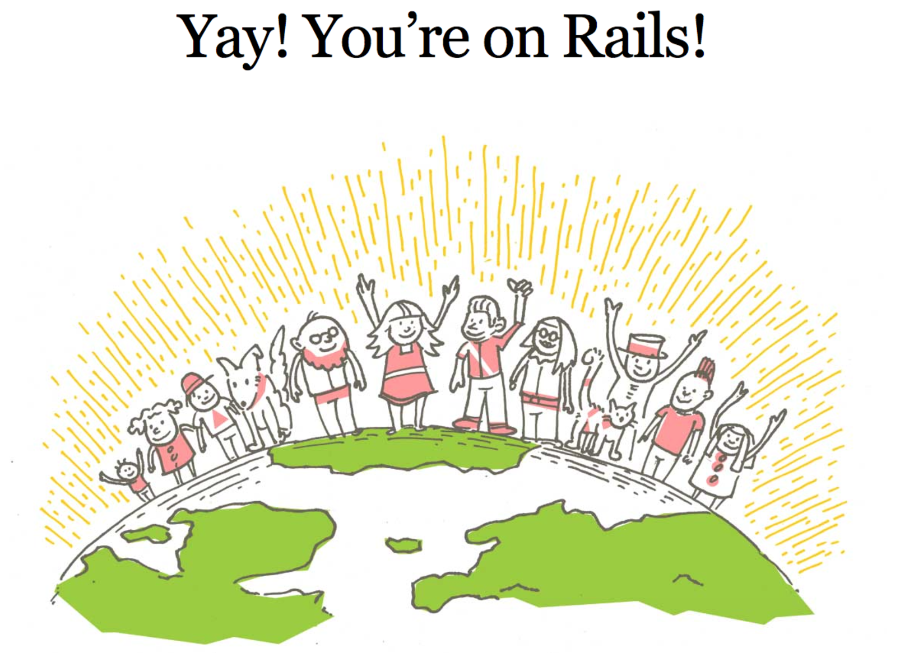

# Ruby on Rails!



### Learning Objectives

- Define and discuss MVC as an architecture
- Dive into the "convention vs configuration" distinction a little more deeply
- Explore the file structure of a Rails app
- Install Rails and build our first app about books


# How does Rails compare with Node?
We've spent the last 9 weeks learning JS\Node\Express\React and now were switching languages and servers all together to Ruby\Rails.  Would you believe that at one point Ruby\Rails was the focus of WDI?  So why the switch?  

Let's take a look at this [comparison](https://medium.com/@TechMagic/nodejs-vs-ruby-on-rails-comparison-2017-which-is-the-best-for-web-development-9aae7a3f08bf) and see why GA made the decision and how they hope it will help position students to fill the need for Node\Express developers. 

Another comparison worth looking at is the [Popularity of Programming Languages Index](http://pypl.github.io/PYPL.html)

# What is MVC?

MVC is an architectural design pattern for creating applications.  It's meant to create separation of concerns for the following:

- Model - Handles data and business logic
- View - Presents data to user
- Controllers - Manages user requests and data manipulation

**Q:** Did we ever intentionally apply the MVC model to our node\express apps?

**NOTE:** Run the express generator as follows and see how close it gets to the MVC model:  **express express_app --view=ejs**

**Q:** To what extend did does this conform to the model and what is missing? 

## There is more than just MVC...
MVC is just one architectural design pattern.  Several other patterns include:

- MVP - Model-View-Presenter
- MVVC - Mode-View-View\Controller

[reference-addyosamani](https://addyosmani.com/resources/essentialjsdesignpatterns/book/#revealingmodulepatternjavascript)

# What is Ruby on Rails?

[Rails](https://rubyonrails.org/) is an **MVC framework** for Ruby. By now you should be able to describe MVC but what is a framework?

<details>
  <summary>**Framework Defined**</summary>
A framework is a program, set of programs, and/or code library that writes most of your application for you. When you use a framework, your job is to write the parts of the application that make it do the specific things you want.  Frameworks use `Domain Specific Language` and require that the implementation of certain functionality follow strict guidelines. 

</details>


# Convention over configuration

Many other frameworks, like Express, give you a lot of flexibility. You can put folders wherever you want, create your own naming conventions, come up with your own best practices, etc. Rails is different.

In Rails, we adopt a philosophy of *convention over configuration*. This means that there is a standard *rails way* of doing things - how your file structrue should be organized, how things should be named, etc. This has many added benefits:

1. Once you learn the Rails way, you no longer have to think about how to organize your application code. This frees up all of your decision making time and energy to work on actual feature development.
2. Rails has been around for a **long** time. The "Rails way" is the result of over a decade of careful consideration and refactoring by thousands of people. The result is an extremely cohesive framework which prioritizes efficiency and developer happiness. Once you get the hang of it, you'll begin to appreciate how elegent Rails actually is.

### The Rails way is the right way!

Don't try to go against the grain in Rails. Follow the conventions, and things will just work. Go against them, and you will hate your life.

## Your new Bible

One of the amazing things about Rails (of which there are many) is that the community is **SUPERB** when it comes to documentation.

The [Ruby on Rails Guides](http://guides.rubyonrails.org/) is the defacto resource for all those getting into Rails, as well as seasoned pros. It is extensive, comprehensive, and easy to read. I highly recommend you read it all the way through, and continue to consult with it as you progress along your Rails journey.

The [Getting Started Guide](http://guides.rubyonrails.org/getting_started.html) can't be beat. If you do the whole thing and take your time, Rails should start to become very intuitive for you.

### Lab 1 - Caputre Your Knowledge of MVC - 20min

Open the labs folder and answer the questions in the **lab_1_mvc_rails.md** file.

Document your understanding of MVC and Rails

### Get the latest version of rails

Before we install rails let's first confirm our version of Ruby:

```ruby
ruby -v 
# ruby 2.4.0p0 (2016-12-24 revision 57164) [x86_64-darwin14]
```

Before we create our first Rails app, we are going to make sure that we have the latest version of the Rails gem. Run:

```
gem update rails
```
You might have to use sudo:

```
sudo gem update rails
```
If you don't have Rails already installed, run:

```
gem install rails
```
and you will get the latest automatically.

Confirm the version of Rails:

```ruby
rails -v
# Rails 5.1.6
```
### Rails new

To create a Rails app, we use the `rails new` command. This sets us up with our skeleton Rails app. There are a lot of options that you can provide with the `rails new` command. Try `rails new --help` to take a look at them all.

```
rails new books 
```

Now if we `cd books` and type

```
rails server
```
Our Rails server will start up and we can visit our rails app at localhost:3000. This opens the default Rails image to confirm our server is up and running.  It uses a server called `Puma` and we can set the listening port using:

```
rails server -p 3001

# or rails s -p 3001
```

### Ruby Folder\File Structure

Let's tak about this huge ass file structure! Open up the new rails app. You'll see a file structure something like this:

<details>
<summary>Complete list of rails folders\files</summary>

```
.
├── Gemfile
├── Gemfile.lock
├── README.md
├── Rakefile
├── app
│   ├── assets
│   │   ├── config
│   │   │   └── manifest.js
│   │   ├── images
│   │   ├── javascripts
│   │   │   ├── application.js
│   │   │   ├── cable.js
│   │   │   └── channels
│   │   └── stylesheets
│   │       └── application.css
│   ├── channels
│   │   └── application_cable
│   │       ├── channel.rb
│   │       └── connection.rb
│   ├── controllers
│   │   ├── application_controller.rb
│   │   └── concerns
│   ├── helpers
│   │   └── application_helper.rb
│   ├── jobs
│   │   └── application_job.rb
│   ├── mailers
│   │   └── application_mailer.rb
│   ├── models
│   │   ├── application_record.rb
│   │   └── concerns
│   └── views
│       └── layouts
│           ├── application.html.erb
│           ├── mailer.html.erb
│           └── mailer.text.erb
├── bin
│   ├── bundle
│   ├── rails
│   ├── rake
│   ├── setup
│   ├── spring
│   ├── update
│   └── yarn
├── config
│   ├── application.rb
│   ├── boot.rb
│   ├── cable.yml
│   ├── database.yml
│   ├── environment.rb
│   ├── environments
│   │   ├── development.rb
│   │   ├── production.rb
│   │   └── test.rb
│   ├── initializers
│   │   ├── application_controller_renderer.rb
│   │   ├── assets.rb
│   │   ├── backtrace_silencers.rb
│   │   ├── cookies_serializer.rb
│   │   ├── filter_parameter_logging.rb
│   │   ├── inflections.rb
│   │   ├── mime_types.rb
│   │   └── wrap_parameters.rb
│   ├── locales
│   │   └── en.yml
│   ├── puma.rb
│   ├── routes.rb
│   ├── secrets.yml
│   └── spring.rb
├── config.ru
├── db
│   └── seeds.rb
├── lib
│   ├── assets
│   └── tasks
├── log
├── package.json
├── public
│   ├── 404.html
│   ├── 422.html
│   ├── 500.html
│   ├── apple-touch-icon-precomposed.png
│   ├── apple-touch-icon.png
│   ├── favicon.ico
│   └── robots.txt
├── test
│   ├── application_system_test_case.rb
│   ├── controllers
│   ├── fixtures
│   │   └── files
│   ├── helpers
│   ├── integration
│   ├── mailers
│   ├── models
│   ├── system
│   └── test_helper.rb
├── tmp
│   └── cache
│       └── assets
└── vendor
```

</details>

Thats a lot for stuff.  But for the app we are creating class, we'll only need to edit a few of these files...

```
.
├── Gemfile
├── app
│   ├── controllers
│   │   ├── application_controller.rb
│   ├── models
│   │   └── application_record.rb 
│   └── views
│       └── layouts
│           └── application.html.erb
├── config
│   └── routes.rb
└── db
    └── seeds.rb
```

### Gemfile
This file is what package.json is to node.  It is used to install all dependencies. There is a great gem called 'gemrat` which we can use for updating the Gemfile  

- gem install gemrat
- gemrat postgresql
- bundle install
- https://jaketrent.com/post/save-gem-to-gemfile-from-terminal/

### The App folder

So in the end we're gonna be building a book inventory app and most of the configurations will happen in the App folder. It contains all of the MVC in MVC. We will be working much more with controllers and views later so we won't go into to much detail right now. 

### The Config Folder

The config folder is used primary to configure routes for the app. 

Let's try to visit a new page in our app. Type `localhost:3000/welcome` into your browser's url bar. What error do you see?

In Rails, we need to define the routes of our application in our routes file. Edit you `config/routes.rb` file to look like this:

```ruby
Rails.application.routes.draw do
  get "/welcome", to: "welcome#index"
end
```

This tells our Rails app that we are defining a GET route named `/welcome`. If we go to terminal and type:

```
rails routes
```

...we will see a list of all of the routes that are defined in our `config/routes.rb` file.

Now go back to the browser and refresh the page. You should see a different error. This error is telling us that we do not have a `WelcomeController` class definied in our app.

This is coming from the second argument we provide to the `get` method in our routes file. The first argument is the name of the route (`/welcome`) and the second argument (`to: 'welcome#index'`) is indicating **where** we want requests that are sent to that route to go. In Rails, the router does not do anything with the requests, it only passes them to the controllers. The controllers then handle the requests and send the responses back to the client.

## Controllers

The controllers in a Rails application handle the requests and send responses. Controllers consist of `actions` - public instance methods that are called by the framework when a request comes in matching the actions route.

In our app, we have stated that requests to the **GET** `/welcome` route should be handled by the WelcomeController, specifically the `index` action within the WelcomeController. So let's create one!

There are two ways to create controllers:

- manually 
- using the "generate" command

First lets add one manually by doing the following:

- Add a file called `welcome_controller.rb` to you `app/controllers` directory.
- Edit your `welcome_controller.rb` file to look like this:

```ruby
class WelcomeController < ApplicationController
  def index
    # says we want to send back plain text
    render plain: "Welcome!"
  end
end
```

Now when your refresh the page you should see the `Welcome!` text.

We can also render JSON...

```
# render json: {hello: 'world'}
```

OR:...

```
# @data = { hello: 'world'}
# render :json => @data
```

OR...

```
# @data = File.read("app/assets/data.json") 
# render :json => @data
```

The other way to create controllers is to use the `generate` command:

```rails
rails generate controller Welcome index
```

This will create quite a few files:

<details>
<summary>Files Created Using Generate</summary>

```
$ rails generate controller Welcome index
Running via Spring preloader in process 88672
      create  app/controllers/welcome_controller.rb
       route  get 'welcome/index'
      invoke  erb
      create    app/views/welcome
      create    app/views/welcome/index.html.erb
      invoke  test_unit
      create    test/controllers/welcome_controller_test.rb
      invoke  helper
      create    app/helpers/welcome_helper.rb
      invoke    test_unit
      invoke  assets
      invoke    coffee
      create      app/assets/javascripts/welcome.coffee
      invoke    scss
      create      app/assets/stylesheets/welcome.scss
```
</details>

For us but the main ones were concerned with are the following: 

- app/controllers/welcome_controller.rb
- app/views/welcome/index.html.erb
- aap/assets/stylesheets/welcome.scss

If we examine the welcome_controller.rb file we will see it has an `index` method but it's empty however we are able to still see content. 

**Question:**Why is that? 
<details> 
<summary>**Answer:**</summary>
If a controller has a method that doesn't explicitly render any thing then it will look for a view with a folder of the same name and render an index file of the same name as the `action`
</details>

### More actions

We have a `get` route in our app that works.  We also can add a `root` route which defaults to `get`, but if we're trying to build a CRUD app, we need to add more routes. 

- How might we declare other HTTP verbs in our routes?
- Compare the routes we've made so far to your garden variety Express router. How does it differ? How is it the same?

```js
router.get('/', db.getAllContacts);
router.post('/', db.createContact);
router.delete('/:id', db.removeContact)
router.patch('/:id', db.updateContact)
```

### Using the resources keyword

Rails also allows us to write these routes with just one line using the `resource` keyword.  A `resource` is a collection of similar objects and can be used to crete a full set of CRUD actions. 

Add this to `config/routes.rb`:

```rb
resources :books
```

Then run `rails routes` again. What do you notice?  Lot's of routes...thats what..

```
       Prefix Verb   URI Pattern               Controller#Action
welcome_index GET    /welcome/index(.:format)  welcome#index
        books GET    /books(.:format)          books#index
              POST   /books(.:format)          books#create
     new_book GET    /books/new(.:format)      books#new
    edit_book GET    /books/:id/edit(.:format) books#edit
         book GET    /books/:id(.:format)      books#show
              PATCH  /books/:id(.:format)      books#update
              PUT    /books/:id(.:format)      books#update
              DELETE /books/:id(.:format)      books#destroy
         root GET    /                         welcome#index
```

If you try accessing the /books route the site will error out due to a missing controller. And how can we fix that?

```
rails generate controller Books
```

Notice how this time we left off `index`.  That is significant as the controller will not create a view. So we will have to do that ourselves. 

### Lab 2 - Routes_Controller_Views - 40min

## More controllers

So far, our books app has:
- A `welcome` route that displays the text `welcome to my books app`
- A `welcome_controller.rb` file
- Books resources

Let's extend our functionality to include:
- When we hit the `/books` endpoint, send back the text "books are cool"
- When we hit the `/books/:mobey_dick` endpoint, send back the text "loved the book moby dick is cool"
- Hint: We're going to have to get the dino from the [`params` object](http://guides.rubyonrails.org/action_controller_overview.html#parameters)

For this lecture, we're only concerned about the `/books` and `/books/:moby_dick` endpoints ... those are going to be the methods `index` and `show`. 

We can set this up in our route by saying:

```rb
resources :books, only: [:index, :show]
```

Extending the controller to support the `show` action which will return just one book based on url params means adding another method.

```
 def show
    # renders what was captured in the url
    render plain: params[:id].inspect
  end
```

If we want to pass the param to a view can do so as follows:

```
 def show
    # renders views/books/show.html.erb
    @book = params[:id]
  end
```

Test out the current show route...Did this work? 

Of course it didn't.  Thats because the `show` action is looking for a show.index.erb file so go ahead and create one in `views\books\show.html.erb`.  The new view will contain the @books instance variable that contains the name of the parameter captured in the url.  The syntax is very similiar to how you display variable data in an ejs file in express. 

```
<h1><%= @book%> was an amazing book</h1>
```

### Lab 3 - More_Controllers - 40min

## Route Helpers

Another godly thing about Rails is that it provides your with **url helper methods** so that you don't have to remember every every route in your app. Add the following line to your `app/views/welcome/index.html.erb` template:

```html
<%= link_to "Dinosaurs", dinos_path %>
```

There are two magics going on here -
1. `link_to` is a method available in Rails views that create anchor tags. The first argument is the text that will be displayed in the link. The second is the href for the link.
2. `dinos_path` is a url helper method that returns the about path, or rather, the path that will resolve to the dinosaur route defined in our routes controller.

### Lab 4 - Planets - 60min

### Check for understanding

- What is the relationship between routes - controllers - views? 
- What are two ways to create controllers?
- How do we render data from within a controller?
- How do we render a template within a controller? 
- Controller methods are called what? 
- How do we use the `resource` keyword? 


